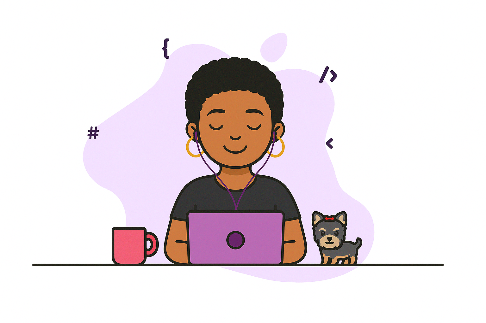

<h1 align="center"> 👋 Hello, I’m Bruna Borges </h1>

<h3 align="center">
  Front-End Developer · Software Engineer
</h3>

  </img>

- 💻 **Front-end Developer** passionate about crafting clean and useful interfaces using **React, Next.js, TypeScript, and Tailwind CSS**.

- 🌍 I’ve been part of global teams and projects where collaboration and adaptability were key and I really enjoy working in that kind of environment.

- 🎯 What drives me is creating products that are not only functional, but also meaningful and easy to use.

- 📫 Reach me at:  **brunaborgesdev@gmail.com**

  

## 🛠️ Tech Stack & Tools

**Front-end & Styling**

  

**Workflow & Tools**

  

**Other knowledge**

  

## 📈 Currently Learning
- Unit testing with Jest  
- Front-end architecture best practices  
- Fullstack Bootcamp (C#, .NET, React, and Java)  

## 🌐 Contact me

  
  

---

### GitHub Status

  

---
💬 “For me, technology is about simplifying life and helping people make better choices every day.”

